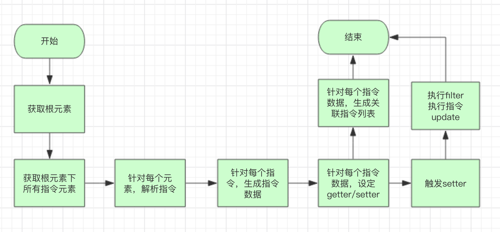

## 最简单的 Vue 实现版本

让我们将 Vue 的历史记录回退到`a5e27b11`这个提交，这个提交是 Vue 提交历史上的**第三个** commit，也是一个 Vue 最初的想法实现，作者将这次提交称之为`“naive implementation”`，通过这个很简单的实现，我们可以了解到 Vue 一个最初的想法。

## 最初的想法

Vue 最初始的 demo 如下：

```html
<div id="test" sd-on-click="changeMessage | .button">
    <p sd-text="msg | capitalize"></p>
    <p sd-show="something">YOYOYO</p>
    <p class="button" sd-text="msg"></p>
    <p sd-class-red="error" sd-text="hello"></p>
</div>
```

```javascript
var Seed = require("seed");
var app = Seed.create({
  id: "test",
  // template
  scope: {
    msg: "hello",
    hello: "WHWHWHW",
    changeMessage: function() {
      app.scope.msg = "hola";
    }
  }
});
```

可以看到，最初的想法很简单，只是希望通过一些定义的内置指令，如`sd-text`，`sd-show`，`sd-on`等，完成整个声明式渲染的过程，并期望通过数据的改变自动触发视图的更新。

::: tip
Vue 一开始取名为 Seed，到 0.6.0 这第一个 Release 发行版本时才正式更名为 Vue
:::

## 初步实现思路

对于这类指令驱动渲染的方式，基本实现思路如下：


1. 识别 id 域下所有绑定了指令的子元素
2. 对所有子元素做遍历
3. 针对每个子元素，解析它的指令属性
4. 解析完指令属性之后，将指令绑定到相应的 scope 数据上
5. 对 scope 数据进行 getter/setter 监听，修改时触发指令更新方法渲染视图

首先，我们注意到调用`Seed`方法时，传入了`id`参数，我们可以获得整个 Vue 的根作用节点：

```javascript
var root = (this.el = document.getElementById(opts.id));
```

同时，我们可以获取到所有支持的指令，作为属性选择器：

```javascript
var prefix = "sd";
var Directives = require("./directives");
var selector = Object.keys(Directives)
  .map(function(d) {
    return "[" + prefix + "-" + d + "]";
  })
  .join(); // 获取到所有的指令属性选择器，如[sd-text][sd-show]这样
```

对所有的指令元素做一次遍历，解析指令(指令是以 HTML 属性的情况存在的)：

```javascript
var els = root.querySelectorAll(selector); // 获取元素列表
els.forEach(function(el) {
  // 克隆HTML属性，防止对属性进行有损读写
  cloneAttributes(el.attributes).forEach(function(attr) {
    var directive = parseDirective(attr);
    // ...
  });
});
```

## 指令解析

Vue 最初的指令定义，想法如下：

```html
<tag [dirname]-[arg]="[key]|[filter1]|[filter2]|..." />
```

其中，各个字段含义如下：

- `dirname` 指令名称
- `arg` 指令参数
- `key` 指令绑定数据（表达式）
- `filter` 指令过滤器

整体解析时，只要保证以上字段的输出即可：

```javascript
function parseDirective(attr) {
  // 省略具体解析过程...

  return def
    ? {
        attr: attr,
        key: key,
        filters: filters,
        definition: def,
        argument: arg,
        update: typeof def === "function" ? def : def.update
      }
    : null;
}
```

其中，对于一个指令，Vue 要求其实现至少有一个`update`方法，同时支持对象和函数两种方式：

```javascript
// 通过函数定义
module.exports = function update(el, value, arg, directive, context) {
  // ...
};
// 通过对象定义
module.exports = {
  bind: function(el, value) {},
  update: function(el, value, arg, directive, context) {},
  unbind: function(el, arg, directive, context) {}
};
```

## binding 实现

在拿到解析过的指令数据之后，就可以实现针对数据的 binding 了：

```javascript
function bindDirective(seed, el, bindings, directive) {
  el.removeAttribute(directive.attr.name);
  var key = directive.key,
    binding = bindings[key];
  if (!binding) {
    bindings[key] = binding = {
      value: undefined,
      directives: []
    };
  }
  directive.el = el;
  binding.directives.push(directive);
  // invoke bind hook if exists
  if (directive.bind) {
    directive.bind(el, binding.value);
  }
  if (!seed.scope.hasOwnProperty(key)) {
    bindAccessors(seed, key, binding);
  }
}
```

对于 binding 的实现还是比较清晰的，定义了一个全局的 bindings 对象，用于存放所有实现 binding 的数据（对 scope 上的数据进行追踪），对于每个 binding 数据，是以每个 directive 的 key 值（见上定义）做主键，一个 binding 数据可以绑定多个 directive，最后便是实现响应式修改的关键逻辑`bindAccessors`：

```javascript
function bindAccessors(seed, key, binding) {
  Object.defineProperty(seed.scope, key, {
    get: function() {
      return binding.value;
    },
    set: function(value) {
      binding.value = value;
      binding.directives.forEach(function(directive) {
        if (value && directive.filters) {
          value = applyFilters(value, directive);
        }
        directive.update(
          directive.el,
          value,
          directive.argument,
          directive,
          seed
        );
      });
    }
  });
}
```

我们重点关注下每个 binding 的 setter，在对每个 binding 进行赋值操作时，都会做以下三件事：

1. 对自身的 value 属性进行赋值
2. 执行 binding 下所有 directive 的 filter
3. 执行 binding 下所有 directive 的 update 方法

最后，binding 对象生成后，我们执行一步**非常关键的操作**：

```javascript
// initialize all variables by invoking setters
for (var key in bindings) {
  self.scope[key] = opts.scope[key];
}
```

该操作会执行一次 scope 下所有 data 的 setter，触发 binding setter，从而触发指令渲染。

## 基本指令实现

在这一次提交中，主要实现的指令有：

- sd-text
- sd-show
- sd-class
- sd-on

在这里，我们来分析一下较为复杂的`sd-on`指令的实现：

```javascript
var on = {
  update: function(el, handler, event, directive) {
    if (!directive.handlers) {
      directive.handlers = {}; // 诸如v-on-click v-on-focus，都会触发on指令的update，因此这里缓存所有handlers
    }
    var handlers = directive.handlers;
    if (handlers[event]) {
      el.removeEventListener(event, handlers[event]); // 如果整个方法重新触发setter，那么先解绑之前的事件
    }
    if (handler) {
      handler = handler.bind(el);
      el.addEventListener(event, handler); // 重新绑定事件函数
      handlers[event] = handler;
    }
  },
  unbind: function(el, event, directive) {
    if (directive.handlers) {
      el.removeEventListener(event, directive.handlers[event]);
    }
  },
  customFilter: function(handler, selectors) {
    return function(e) {
      var match = selectors.every(function(selector) {
        return e.target.webkitMatchesSelector(selector);
      });
      if (match) handler.apply(this, arguments); // 这里主要是为了支持传入selector的语法，针对特定的元素进行事件绑定，如v-on-click="handler|.button"，这里可以先忽略，后面有更好的实现方式。
    };
  }
};
```

## 基本过滤器实现

这一个初始实现只实现了一个非常简单的过滤器——`capitalize`:

```javascript
var capitalize = function(value) {
  value = value.toString();
  return value.charAt(0).toUpperCase() + value.slice(1);
};
```
